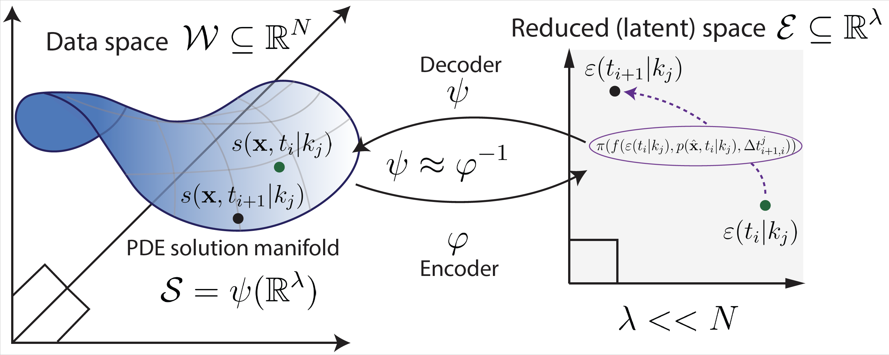
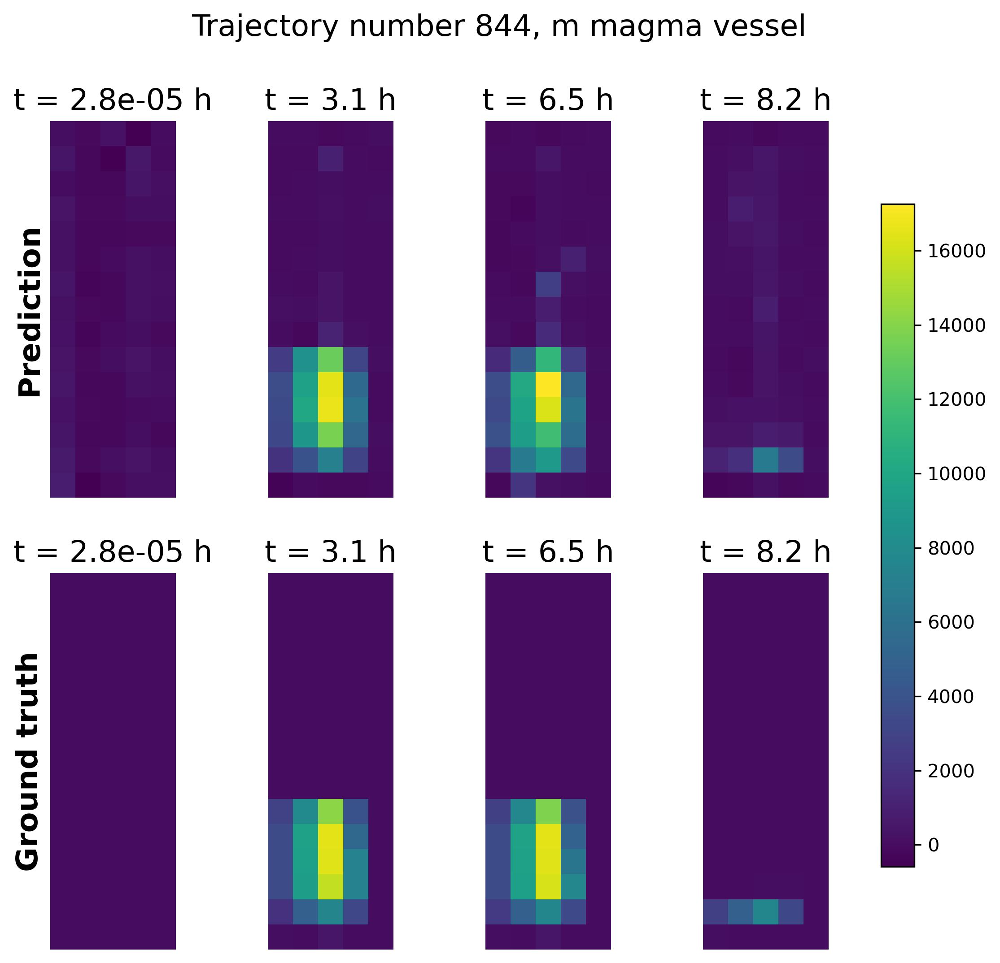

# Deep Learning based surrogate model of severe accidents in nuclear reactors (from the ASTEC simulator)



Simulations of severe accidents in nuclear reactors can take up to months to run, making their use unfeasible to train nuclear operators to react correctly in order to prevent catastrophic events like core melting. In this project we construct a surrogate model of the ASTEC simulator [2], based on the data-driven methodology developed in [3]. The link with an official paper will be posted when available.
This project has been developed within the European project ASSAS [1].

---

**First dataset generation**
```bash
python -u -m src.dataset_generation.dataset.main
```

**Train**
```bash
python -u -m src.models.AE_NODE.training.main
```

**Test**
```bash
python -u -m src.models.AE_NODE.testing.main
```
## Result examples

<p align="center">
  
  
</p>

## References

[1] ASSAS Consortium. *ASSAS -- Artificial Intelligence for Simulation of Severe Accidents*. Horizon Europe Project, coordinated by ASNR, 2023–2026. https://assas-horizon-euratom.eu

[2] Chailan, L., Bosland, L., Carénini, L., Chambarel, J., Cousin, F., et al. *Overview of ASTEC Integral Code Status and Perspectives*. 9th European Review Meeting on Severe Accident Research (ERMSAR2019), Prague, Czech Republic, March 2019. DOI: irsn-04106726

[3] Longhi, A., Lathouwers, D., & Perkó, Z. *Latent space modeling of parametric and time-dependent PDEs using neural ODEs*. Computer Methods in Applied Mechanics and Engineering, 448, 118394, January 2026. https://doi.org/10.1016/j.cma.2025.118394