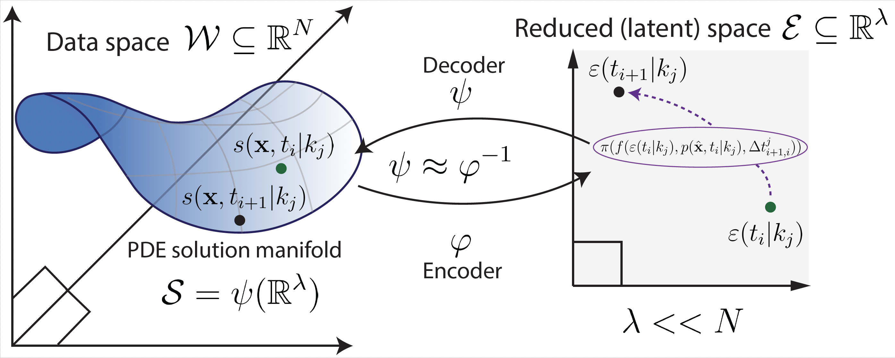
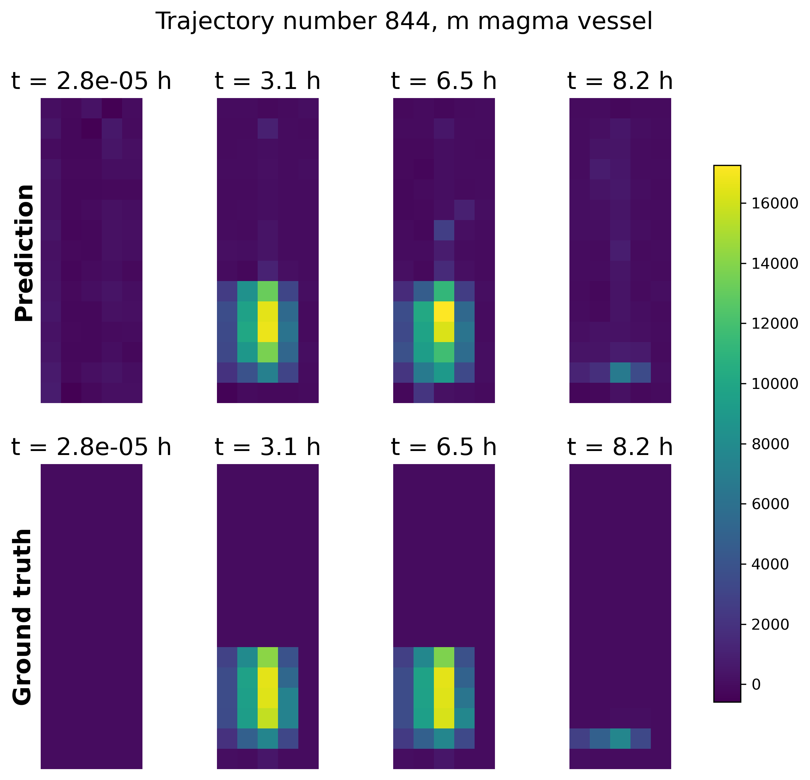

# A deep learning-based surrogate model for Severe Accidents in nuclear reactors using ASTEC

This repository contains the official implementation of the paper [*A deep learning-based surrogate model for Severe Accidents in nuclear reactors using ASTEC*](https://doi.org/10.1016/j.anucene.2026.112854) (Annals of Nuclear Energy, 2027) [1].

Simulations of severe accidents in nuclear reactors with integral codes such as ASTEC [3] are computationally expensive: a single transient can take up to months to run. This makes them impractical for applications that require many fast evaluations, such as training nuclear operators to take the correct actions to prevent core degradation. This repository provides a deep learning surrogate model of ASTEC, based on the data-driven methodology developed in [4], which reproduces the evolution of the reactor vessel at a fraction of the computational cost.

This work was carried out within the European project ASSAS [2].

## Method

Following [4], the severe-accident transient is treated as a parametrized, time-dependent physical system governed by an (unknown) system of PDEs. The surrogate model consists of three components approximated by neural networks:

1. an **Encoder**, which compresses the 1996 degrees of freedom of the ASTEC solution (about 80 physical variables, both scalars and spatial fields) into a low-dimensional latent vector;
2. a **Processor**, a Neural ODE (NODE) that advances the latent vector in time with an explicit Runge–Kutta scheme, conditioned on the (encoded) hot- and cold-leg conditions at the vessel boundaries, through which the effect of the operator actions enters the vessel;
3. a **Decoder**, which maps the latent vector back to the full set of physical variables.

At inference time, the initial state is encoded once, the latent trajectory is computed autoregressively by the Processor, and each latent vector is decoded to recover the physical variables.

- **Task:** prediction of the time evolution of about 80 physical variables in the reactor vessel as a function of the activation times of 10 operator actions.
- **Framework:** PyTorch.

## Dataset

The dataset consists of ASTEC [3] simulations generated within the ASSAS project [2] for two accident scenarios in a simplified 4-loop 1300 MWe PWR: a Large Break Loss-of-Coolant Accident (LB-LOCA) and a Station Blackout (SBO). The simulations differ only in the activation times of the operator actions and start from the same nominal-power initial condition.

The surrogate model covers the **vessel domain** up to vessel rupture, replacing the coupled ICARE (core degradation) and CESAR (thermal-hydraulics) modules of ASTEC. The vessel is a 2D axisymmetric grid of 5 rings × 15 axial levels plus the lower plenum, with 140 faces between adjacent volumes. The model is driven by the conditions in the first volumes of the hot and cold legs (12 variables each) and predicts:

| Group | Variables |
|---|---|
| Global (scalar) | 4, plus the mass flow rates of 53 fission product elements |
| Lower plenum | 18 |
| Core (36 volumes) | 4 per volume |
| Vessel (75 volumes) | 18 per volume |
| Faces (140) | 3 per face |
| Boundaries with the hot and cold legs | 3 each |

The vessel geometry, the index map, the full list of variables with their units, and the coupling with the primary circuit are described in [dataset_vessel.md](src/dataset_generation/dataset_vessel.md).

## Installation

```bash
git clone git@github.com:Aleartulon/ASTEC_surrogate_model.git
cd ASTEC_surrogate_model

conda env create -f environment.yml
conda activate artu
```

> [!NOTE]
> The environment installs PyTorch 2.5.1 built for CUDA 12.1. Training falls back to the CPU if CUDA is unavailable, so check with `python -c "import torch; print(torch.cuda.is_available())"` and, if needed, install a build suitable for your platform following the [PyTorch instructions](https://pytorch.org/get-started/locally/).

## Data preparation

The ASTEC simulations are stored as HDF5 files on the ASSAS Data Hub (access requires credentials). The scripts in [src/dataset_generation/download_and_explore/](src/dataset_generation/download_and_explore/) prepare them for dataset generation:

1. [dataset_download.py](src/dataset_generation/download_and_explore/dataset_download.py) downloads all valid simulations from the Data Hub;
2. [change_name_hdf5_file.py](src/dataset_generation/download_and_explore/change_name_hdf5_file.py) renames each file with the simulation name stored on the Data Hub;
3. [rename_files_with_numbers.py](src/dataset_generation/download_and_explore/rename_files_with_numbers.py) renames the files with integer indices (`1.h5`, `2.h5`, ...) and writes `rename_log.txt`, which maps each index to the original simulation name and is required by the next steps.

## Usage

All scripts read their settings from the YAML files in [configs/](configs/) and must be launched from the repository root. Every entry is documented by an inline comment; at minimum, set the data paths, the trajectory index ranges and the device for your system.

**1. Dataset generation** ([configs/config_dataset.yaml](configs/config_dataset.yaml)). Builds the normalized training and validation datasets (`testing: false`) or the test dataset (`testing: true`) from the renamed HDF5 files:

```bash
python -u -m src.dataset_generation.dataset.main
```

The entries `testing`, `path_to_hdf5`, `where_to_save_data`, `which_normalization` and `device` can also be overridden from the command line (e.g. `--testing true`).

**2. Time-windowed datasets** ([configs/config_sliced_dataset.yaml](configs/config_sliced_dataset.yaml)). Splits the training and validation trajectories into subsequences of length `t_W`, which are used for training:

```bash
python -u -m src.dataset_generation.sliced_dataset.main
```

This step can be skipped by setting `dynamic_dataset_generation_during_training: true` in the training configuration, in which case the time-windowed datasets are regenerated automatically during training for each entry of `time_windows`.

**3. Training** ([configs/config_training.yaml](configs/config_training.yaml) and [configs/configs_models/config_AE_NODE.yaml](configs/configs_models/config_AE_NODE.yaml)):

```bash
python -u -m src.models.AE_NODE.training.main
```

Results are written to `<physics_model>/AE_NODE/Models/<description>/`, together with a copy of the code and configuration used for the run.

**4. Testing** ([configs/config_test.yaml](configs/config_test.yaml)). Rolls out the trained model on the test trajectories, computes the error metrics and generates the figures:

```bash
python -u -m src.models.AE_NODE.testing.main
```

A nearest-neighbour baseline, which predicts each test trajectory with the training trajectory whose operator actions are closest, is evaluated with

```bash
python -u -m src.models.AE_NODE.testing.baseline_test
```

## Example results

<p align="center">
  
  
</p>

LB-LOCA trajectory 844. Left: latent trajectory obtained by encoding the ASTEC solution (dashed) and predicted autoregressively by the NODE (solid). Right: mass of molten material (magma) in the vessel predicted by the surrogate model and computed by ASTEC at four time instants.

## Repository structure

```plaintext
├── assets/                          # figures used in this README
├── configs/
│   ├── config_dataset.yaml          # dataset generation
│   ├── config_sliced_dataset.yaml   # time-windowed datasets
│   ├── config_training.yaml         # training settings
│   ├── config_test.yaml             # testing settings
│   └── configs_models/
│       └── config_AE_NODE.yaml      # network architecture and loss settings
├── environment.yml
└── src/
    ├── common_functions.py
    ├── plot_losses.py               # plots of the training and validation losses
    ├── dataset_generation/
    │   ├── download_and_explore/    # download and renaming of the ASTEC HDF5 files
    │   ├── dataset/                 # normalized training, validation and test datasets
    │   └── sliced_dataset/          # time-windowed training and validation datasets
    └── models/AE_NODE/
        ├── training/                # architecture, losses and training loop
        └── testing/                 # evaluation, baseline and error plots
```

## Citation

If you use this code in your research, please cite:

```bibtex
@article{longhi2027deep,
  title   = {A deep learning-based surrogate model for Severe Accidents in nuclear reactors using {ASTEC}},
  author  = {Longhi, Alessandro and Lathouwers, Danny and Perk{\'o}, Zolt{\'a}n},
  journal = {Annals of Nuclear Energy},
  volume  = {241},
  pages   = {112854},
  year    = {2027},
  doi     = {10.1016/j.anucene.2026.112854}
}
```

A preprint is available on [arXiv:2607.04450](https://arxiv.org/abs/2607.04450).

## Acknowledgements

This work was carried out within the ASSAS project (Artificial Intelligence for Simulation of Severe Accidents) [2], funded by the European Union's Horizon Europe Euratom programme.

## References

[1] Longhi, A., Lathouwers, D., & Perkó, Z. *A deep learning-based surrogate model for Severe Accidents in nuclear reactors using ASTEC*. Annals of Nuclear Energy, 241, 112854, 2027. https://doi.org/10.1016/j.anucene.2026.112854

[2] ASSAS Consortium. *ASSAS – Artificial Intelligence for Simulation of Severe Accidents*. Horizon Europe project, coordinated by ASNR, 2023–2026. https://assas-horizon-euratom.eu

[3] Chailan, L., Bosland, L., Carénini, L., Chambarel, J., Cousin, F., et al. *Overview of ASTEC Integral Code Status and Perspectives*. 9th European Review Meeting on Severe Accident Research (ERMSAR 2019), Prague, Czech Republic, March 2019. HAL: [irsn-04106726](https://hal.science/irsn-04106726)

[4] Longhi, A., Lathouwers, D., & Perkó, Z. *Latent space modeling of parametric and time-dependent PDEs using neural ODEs*. Computer Methods in Applied Mechanics and Engineering, 448, 118394, 2026. https://doi.org/10.1016/j.cma.2025.118394

## Contact

For questions, please contact Alessandro Longhi at [a.longhi@tudelft.nl](mailto:a.longhi@tudelft.nl).
