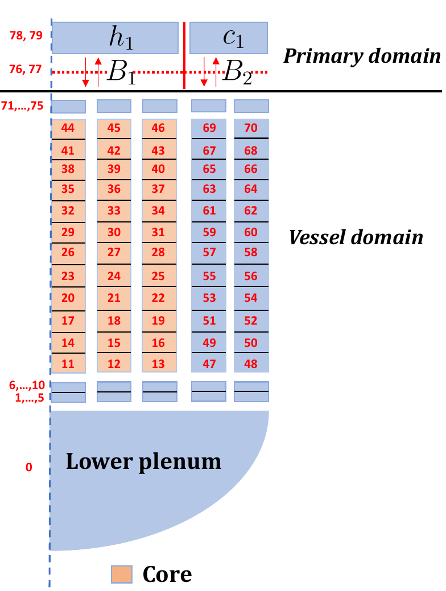
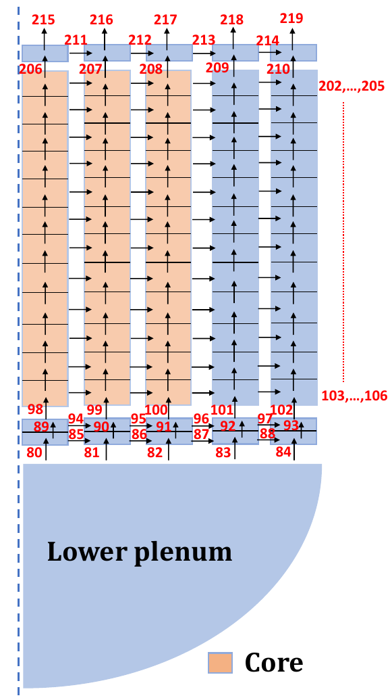

# Vessel Surrogate Model — Geometry & Variables Guide

## Overview

This document describes the geometry, variables, and boundary conditions used to build a Deep Learning surrogate model (SM) of the **vessel domain** of a PWR reactor during severe accidents. The SM replaces the coupled ICARE (core degradation) and CESAR (thermal-hydraulics) modules of the ASTEC code.

The simulations cover two accident types on a simplified 4-loop 1,300 MWe PWR:

1. **LB-LOCA** — Large Break Loss-of-Coolant Accident (with SI and CSS failure)
2. **SBO** — Station Blackout (with AFW failure)

The only source of variation across simulations is the **timing of 12 operator actions** (sampled via Sobol sequences). The reactor always starts from the same nominal-power initial condition. The SM predicts the vessel physics **up to vessel rupture**.

---

## Vessel Geometry

The vessel is a **2D axisymmetric** structure with **5 concentric rings** (columns) and **15 axial levels**, plus a single additional volume at the bottom for the **lower plenum**.

### Index Map

| Region | Index range | Description |
|---|---|---|
| Lower plenum | `0` | Single volume at the very bottom of the vessel |
| Vessel grid | `1 – 75` | 5 columns × 15 rows (bottom-to-top, left-to-right within each row) |
| Core subset | `11 – 46` | The first 3 columns (rows 1–12), where fuel rods are located |
| Boundary B₁ | `76` | Connection point between vessel and hot leg |
| Boundary B₂ | `77` | Connection point between vessel and cold leg |
| Hot leg first volume (h₁) | `78` | First control volume of the hot leg (primary circuit) |
| Cold leg first volume (c₁) | `79` | First control volume of the cold leg (primary circuit) |
| Faces | `80 – 219` | 140 interfaces between adjacent vessel volumes |

### Column layout (left to right)

- **Columns 1–3** — contain fuel rods (the "core" region, indices 11–46)
- **Columns 4–5** — vessel volumes without fuel (indices 47–75 plus bottom rows 1–10)

### How faces work

Each **face** sits at the interface between two volumes and carries the flow variables at that boundary. For example, face `5` is the interface between the lower plenum (index `0`) and the bottom volume of the 5th column.

---

## Variable Groups

### Inputs to the SM

The SM receives as input the time history of the **hot leg** and **cold leg** variables up to the current time step. These come from the primary circuit domain.

#### Hot leg — p(h₁) (index 78) — 13 variables

| Variable | Unit |
|---|---|
| Void fraction | - |
| Steam partial pressure | Pa |
| Gas temperature | K |
| Saturation pressure | Pa |
| Hydrogen partial pressure | Pa |
| Total pressure | Pa |
| Steam mass | kg |
| Liquid density | kg/m³ |
| Liquid mass | kg |
| Saturation temperature | K |
| Void fraction of steam-water | - |
| Liquid temperature | K |
| Pressure above water level | Pa |

#### Cold leg — p(c₁) (index 79) — 13 variables

Same 13 variables as the hot leg (listed above).

---

### Outputs of the SM

Everything below is **predicted** by the surrogate model (and fed back autoregressively at each time step).

#### Global variables — s_g — scalar in time

| Variable | Short name | Unit |
|---|---|---|
| H₂ cumulated mass in the core | m cum H2 | kg |
| Corium mass in the core | m tot cor | kg |
| Total activity in domain | FP A heat | Bq |
| Maximum saturation in core meshes | sat core mesh | - |
| Mean mass flowrate of 53 fission product elements | FP (×53) | kg/s |

The 53 fission product elements are: Ac, Ag, Am, As, Ba, Br, Cd, Ce, Cm, Cs, Cu, Dy, Er, Eu, Ga, Gd, Ge, Ho, I, Ln, Kr, La, Mo, Nb, Nd, Np, Pa, Pd, Pm, Pr, Pu, Ra, Rb, Re, Rh, Ru, Sb, Se, Sm, Sn, Sr, Tb, Tc, Te, Th, Tl, Tm, U, Xe, Y, Yb, Zn, Zr.

#### Lower plenum variables — s_p (index 0) — 15 variables

| Variable | Short name | Unit |
|---|---|---|
| Pressure | P | Pa |
| Gaseous phase temperature | T gas | K |
| Liquid phase temperature | T liq | K |
| Void fraction | x alpha | - |
| Saturation temperature | T sat | K |
| Hydrogen pressure | P H2 | Pa |
| Steam pressure | P steam | Pa |
| Mass of gaseous phase | m gas | kg |
| Mass of liquid phase | m liq | kg |
| Density of gaseous phase | rho gas | kg/m³ |
| Density of liquid | rho liq | kg/m³ |
| Liquid to vapor flowrate | Q liq vap | kg/s |
| Porosity of mesh with rods | porosity | - |
| Volume proportion debris classes | V deb | - |
| Volume proportion magma | V mag | - |

#### Core variables — s_cr (indices 11–46, 36 volumes) — 4 variables per volume

| Variable | Short name | Unit |
|---|---|---|
| Fuel component temperature | T comp fuel | K |
| Clad component temperature | T comp clad | K |
| Component state of fuel | state fuel | - |
| Component state of cladding | state clad | - |

#### Vessel variables — s_v (indices 1–75, 75 volumes) — 17 variables per volume

| Variable | Short name | Unit |
|---|---|---|
| Pressure | P | Pa |
| Gaseous phase temperature | T gas | K |
| Liquid phase temperature | T liq | K |
| Void fraction | x alpha | - |
| Saturation temperature | T sat | K |
| Hydrogen pressure | P H2 | Pa |
| Steam pressure | P steam | Pa |
| Mass of gaseous phase | m gas | kg |
| Mass of liquid phase | m liq | kg |
| Density of gaseous phase | rho gas | kg/m³ |
| Density of liquid | rho liq | kg/m³ |
| Liquid to vapor flowrate | Q liq vap | kg/s |
| Porosity of mesh with rods | porosity | - |
| Volume proportion debris classes | V deb | - |
| Volume proportion magma | V mag | - |
| Vessel debris 0 mass | m debris 0 | kg |
| Vessel debris 1 mass | m debris 1 | kg |

#### Face variables — s_f (indices 80–219, 140 faces) — 3 variables per face

| Variable | Short name | Unit |
|---|---|---|
| Liquid mass flow rate | Q m liq | kg/s |
| Gas velocity | V gas | m/s |
| Liquid velocity | V liq | m/s |

#### Boundary B₁ — s_B₁ (index 76) — 3 variables

| Variable | Short name | Unit |
|---|---|---|
| Instantaneous steam mass flow | Q steam ptv | kg/s |
| Instantaneous water flow | Q H2O ptv | kg/s |
| Cumulative total mass of water | m H2O ptv | kg |

#### Boundary B₂ — s_B₂ (index 77) — 3 variables

| Variable | Short name | Unit |
|---|---|---|
| Instantaneous steam mass flow | Q steam vtp | kg/s |
| Instantaneous water flow | Q H2O vtp | kg/s |
| Cumulative total mass of water | m H2O vtp | kg |

---

## Boundary Conditions & Coupling

The vessel domain connects to the **primary circuit** through two boundary points:

- **B₁ (index 76)** ↔ hot leg first volume **h₁ (index 78)**
- **B₂ (index 77)** ↔ cold leg first volume **c₁ (index 79)**

In the SM framework:

- **Input (from primary circuit):** the full time history of p(h₁) and p(c₁) up to the current time step drives the vessel physics.
- **Output (predicted by SM):** all vessel, core, plenum, face, global, and boundary variables — including s_B₁ and s_B₂, which are needed to couple back to the primary circuit.

In other words, the SM takes primary-circuit conditions at the vessel boundary and predicts everything inside the vessel, plus the boundary fluxes that the primary circuit solver needs for the next coupling step.

---

## Operator Actions (Source of Variation)

Each simulation is parameterized by a vector **k** of 12 operator action activation times. Key actions include:

| Action | Description |
|---|---|
| Opensrv | Open pilot-operated relief valve (PORV) during DBA |
| Pu₅ | Activate filtered containment venting at pressure setpoint |
| t₁ˢʳᵛ | PORV opening time during DBA phase |
| t₂ˢʳᵛ | Fully open PORV during SA phase |
| tᶠᵇˢᵉᵇ | Switch pressurizer valve operation mode |
| tᶜˢˢ | Restore containment spray system |
| tᵉⁿᵈˢˢᵍ² | Close PORV following SGTR |
| tᵖᵉˢᵖ | Start RCS pumps |
| tᵖᵉˢˢᵍ | Start SG pumps |
| tˢᵍ²ᵗʳ | SGTR occurrence time |

These are sampled using **Sobol low-discrepancy sequences** with constraints to keep action sequences physically meaningful. Combined with the accident type (LOCA or SBO), they are the only source of variation since the initial condition is always the same.