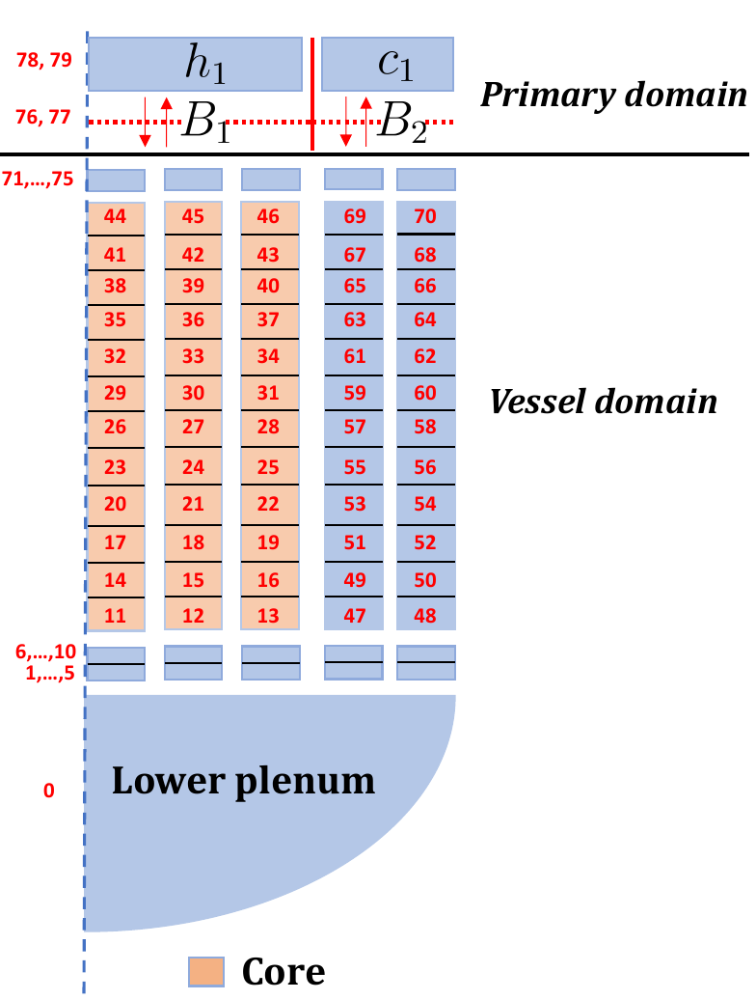
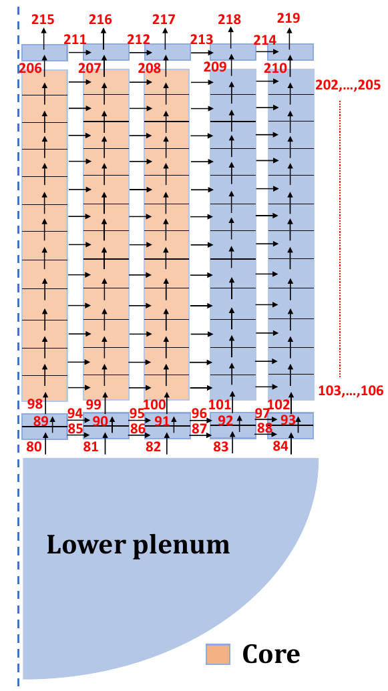

# Vessel Surrogate Model — Geometry and Variables

## Overview

This document describes the geometry, variables and boundary conditions used to build a deep learning surrogate model (SM) of the **vessel domain** of a PWR during severe accidents. The SM replaces the coupled ICARE (core degradation) and CESAR (thermal-hydraulics) modules of the ASTEC code.

The simulations cover two accident scenarios in a simplified 4-loop 1300 MWe PWR:

1. **LB-LOCA**: Large Break Loss-of-Coolant Accident, with failure of the Safety Injection (SI) and of the Containment Spray System (CSS);
2. **SBO**: Station Blackout, with failure of the Auxiliary Feedwater (AFW).

The only source of variation across simulations is the **timing of 10 operator actions**, sampled with Sobol sequences. The reactor always starts from the same nominal-power initial condition, and the SM predicts the vessel physics **up to vessel rupture**.

---

## Vessel geometry

The vessel is a **2D axisymmetric** structure with **5 concentric rings** (columns) and **15 axial levels**, plus a single additional volume at the bottom for the **lower plenum**.

### Index map

| Region | Index range | Description |
|---|---|---|
| Lower plenum | `0` | Single volume at the bottom of the vessel |
| Vessel grid | `1 – 75` | 5 columns × 15 rows, numbered row by row from bottom to top (left to right within each row) |
| Core subset | `11 – 46` | The first 3 columns, where the fuel rods are located |
| Boundary $B_1$ | `76` | Connection between the vessel and the hot leg |
| Boundary $B_2$ | `77` | Connection between the vessel and the cold leg |
| Hot leg first volume ($h_1$) | `78` | First control volume of the hot leg (primary circuit) |
| Cold leg first volume ($c_1$) | `79` | First control volume of the cold leg (primary circuit) |
| Faces | `80 – 219` | 140 interfaces between adjacent vessel volumes |

### Column layout (left to right)

- **Columns 1–3**: volumes containing fuel rods;
- **Columns 4–5**: volumes without fuel.

### Faces

Each **face** lies at the interface between two volumes and carries the flow variables across that interface. For example, face `84` is the interface between the lower plenum (index `0`) and the bottom volume of the 5th column.

---

## Variable groups

### Inputs to the SM

The SM receives as input the variables of the **hot leg** and **cold leg** first volumes, from which it predicts the variables at $B_1$ and $B_2$ and in the rest of the vessel. These variables are read from the HDF5 path `primary/volume/{variable}`, at index $0$ for the hot leg and index $12$ for the cold leg.

#### Hot leg — $p(h_1)$ (index 78) — 12 variables

The HDF5 files also contain `P_up_primary_volume`, which is always NaN and is therefore excluded.

| Variable | Unit |
|---|---|
| Void fraction | - |
| Steam partial pressure | Pa |
| Gas temperature | K |
| Saturation pressure | Pa |
| Hydrogen partial pressure | Pa |
| Total pressure | Pa |
| Steam mass | kg |
| Liquid density | kg/m³ |
| Liquid mass | kg |
| Saturation temperature | K |
| Void fraction of steam-water | - |
| Liquid temperature | K |

#### Cold leg — $p(c_1)$ (index 79) — 12 variables

Same 12 variables as the hot leg.

---

### Outputs of the SM

All the variables below are **predicted** by the SM.

#### Global variables — $s_g$ — scalar time series

| Variable | Short name | Unit |
|---|---|---|
| Cumulative $H_2$ mass in the core | m cum H2 | kg |
| Corium mass in the core | m tot cor | kg |
| Total activity in the domain | FP A heat | Bq |
| Maximum saturation in the core meshes | sat core mesh | - |
| Mean mass flow rate of 53 fission product elements | FP (×53) | kg/s |

The 53 fission product elements are: Ac, Ag, Am, As, Ba, Br, Cd, Ce, Cm, Cs, Cu, Dy, Er, Eu, Ga, Gd, Ge, Ho, I, In, Kr, La, Mo, Nb, Nd, Np, Pa, Pd, Pm, Pr, Pu, Ra, Rb, Re, Rh, Ru, Sb, Se, Sm, Sn, Sr, Tb, Tc, Te, Th, Tl, Tm, U, Xe, Y, Yb, Zn, Zr.

#### Lower plenum variables — $s_p$ (index 0) — 18 variables

| Variable | Short name | Unit |
|---|---|---|
| Pressure | P | Pa |
| Gas phase temperature | T gas | K |
| Liquid phase temperature | T liq | K |
| Void fraction | x alpha | - |
| Saturation temperature | T sat | K |
| Hydrogen partial pressure | P H2 | Pa |
| Steam partial pressure | P steam | Pa |
| Gas phase mass | m gas | kg |
| Liquid phase mass | m liq | kg |
| Gas phase density | rho gas | kg/m³ |
| Liquid phase density | rho liq | kg/m³ |
| Liquid-to-vapour flow rate | Q liq vap | kg/s |
| Porosity of the mesh with rods | porosity | - |
| Volume fraction of debris classes | V deb | - |
| Volume fraction of magma | V mag | - |
| Magma mass | m magma | kg |
| Debris 0 mass | m debris 0 | kg |
| Debris 1 mass | m debris 1 | kg |

#### Core variables — $s_{cr}$ (indices 11–46, 36 volumes) — 4 variables per volume

| Variable | Short name | Unit |
|---|---|---|
| Fuel component temperature | T comp fuel | K |
| Cladding component temperature | T comp clad | K |
| Fuel component state | state fuel | - |
| Cladding component state | state clad | - |

#### Vessel variables — $s_v$ (indices 1–75, 75 volumes) — 18 variables per volume

| Variable | Short name | Unit |
|---|---|---|
| Pressure | P | Pa |
| Gas phase temperature | T gas | K |
| Liquid phase temperature | T liq | K |
| Void fraction | x alpha | - |
| Saturation temperature | T sat | K |
| Hydrogen partial pressure | P H2 | Pa |
| Steam partial pressure | P steam | Pa |
| Gas phase mass | m gas | kg |
| Liquid phase mass | m liq | kg |
| Gas phase density | rho gas | kg/m³ |
| Liquid phase density | rho liq | kg/m³ |
| Liquid-to-vapour flow rate | Q liq vap | kg/s |
| Porosity of the mesh with rods | porosity | - |
| Volume fraction of debris classes | V deb | - |
| Volume fraction of magma | V mag | - |
| Magma mass | m magma | kg |
| Debris 0 mass | m debris 0 | kg |
| Debris 1 mass | m debris 1 | kg |

#### Face variables — $s_f$ (indices 80–219, 140 faces) — 3 variables per face

| Variable | Short name | Unit |
|---|---|---|
| Liquid mass flow rate | Q m liq | kg/s |
| Gas velocity | V gas | m/s |
| Liquid velocity | V liq | m/s |

#### Boundary $B_1$ — $s_{B_1}$ (index 76) — 3 variables

These variables are read from index $0$ of the HDF5 path `connection/general/{variable}`. The other variables of this volume are either NaN or missing in the HDF5 files.

| Variable | Short name | Unit |
|---|---|---|
| Instantaneous steam mass flow rate | Q steam ptv | kg/s |
| Instantaneous water mass flow rate | Q H2O ptv | kg/s |
| Cumulative total water mass | m H2O ptv | kg |

#### Boundary $B_2$ — $s_{B_2}$ (index 77) — 3 variables

These variables are read from index $1$ of the HDF5 path `connection/general/{variable}`. The other variables of this volume are either NaN or missing in the HDF5 files.

| Variable | Short name | Unit |
|---|---|---|
| Instantaneous steam mass flow rate | Q steam vtp | kg/s |
| Instantaneous water mass flow rate | Q H2O vtp | kg/s |
| Cumulative total water mass | m H2O vtp | kg |

---

## Boundary conditions and coupling

The vessel domain is connected to the **primary circuit** through two boundary points:

- **$B_1$ (index 76)** ↔ hot leg first volume **$h_1$ (index 78)**;
- **$B_2$ (index 77)** ↔ cold leg first volume **$c_1$ (index 79)**.

In the following, $p(t_i) = \big(p(h_1)(t_i), p(c_1)(t_i)\big)$ denotes the primary-circuit conditions and $s(t_i) = \big(s_g(t_i), s_p(t_i), s_v(t_i), s_{cr}(t_i), s_f(t_i), s_{B_1}(t_i), s_{B_2}(t_i)\big)$ the vessel state at time $t_i$.

In the SM framework:

- **Input (from the primary circuit):** at each time step, $p$ must be provided to the SM, which is thereby informed of the changes at the boundaries driven by the operator actions.
- **Output (predicted by the SM):** all the variables in $s$, including $s_{B_1}$ and $s_{B_2}$, which are needed to couple back to the primary circuit.

In other words, the SM takes the primary-circuit conditions at $h_1$ and $c_1$ and predicts everything inside the vessel, together with the boundary fluxes that the primary-circuit solver needs at the next coupling step.

The distinction between inputs and outputs is the following. The **inputs** are the quantities that drive the vessel dynamics: without $p$ at time $t$, neither the SM nor any physical solver could predict the next time step. The **outputs**, instead, are not required to predict one another: removing, e.g., the core variables from the dataset would still allow the vessel variables to be predicted, whereas removing $p$ would not. In principle, one could therefore devise a surrogate model that performs the direct mapping

$$p(t_{i+1}) \rightarrow s(t_{i+1}),$$

which does not require the initial condition, since the initial condition is the same for all simulations.

Depending on the surrogate model, one may instead predict the outputs autoregressively, i.e., compute $s(t_{i+1})$ from $s(t_i)$ and $p(t_i)$. In this case $s(t_i)$ is also an input to the model, although it is not strictly necessary for the prediction.

## SM time stepping and coupling logic

ICARE and CESAR are internally coupled through a non-trivial sub-cycling scheme, with micro time steps $\delta t_1$ and $\delta t_2$. The SM **operates only at the macro time steps** and ignores all intermediate sub-steps. In the autoregressive formulation, at each macro step the SM predicts the vessel state at time $t_{i+1}$ from two inputs:

- the **current vessel state** $s(t_i)$ (all vessel, core, plenum, face, global and boundary variables);
- the **current primary-circuit state** $p(t_i)$ (the hot leg $h_1$ and cold leg $c_1$ variables), provided by the primary-circuit model.

Since $p$ is an input and $s_{B_1}$ and $s_{B_2}$ are outputs, the SM **completely decouples the vessel from the rest of the reactor**. This enables a modular coupling strategy in which the primary circuit is handled either by another SM or by ASTEC itself.

### Coupling loop

At each macro time step, the vessel SM and the primary-circuit model exchange data as follows:

1. the **primary-circuit model** computes $p(t_i)$;
2. the **vessel SM** takes $p(t_i)$ and $s(t_i)$ as input and predicts $s(t_{i+1})$;
3. the **primary-circuit model** reads the predicted boundary variables $s_{B_1}(t_{i+1})$ and $s_{B_2}(t_{i+1})$ and computes $p(t_{i+1})$;
4. repeat from step 2.
